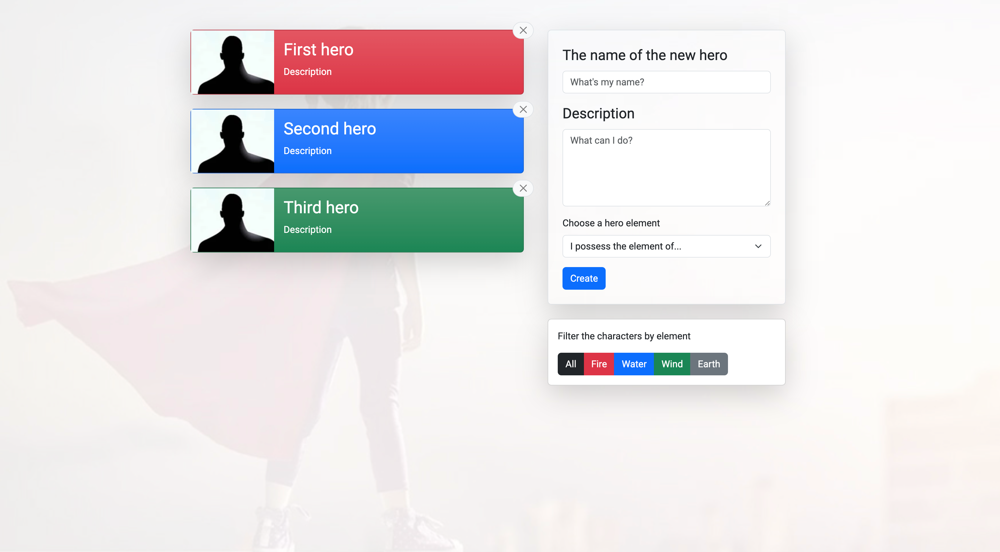

# Launching a web page



React app that you can use as a blueprint for your projects.

## Description

In the hero_admin_panel_template application you can add new characters to the list and delete existing ones, you can enable filters on which the character(s) will be searched for.
In the application, I used React and Redux.

## Features

- Add new characters to the list
- Delete existing characters
- Apply filters to search for characters
- Responsive design
- User-friendly interface

## Technologies Used

- React
- Redux
- JavaScript
- HTML
- CSS

## Prerequisites

Make sure you have Node.js and npm installed on your machine.

## Installing all project dependencies

```bash
npm install
```

## Running the application on the local server

```bash
npm start
```

## Contributing

If you would like to contribute to this project, please fork the repository and submit a pull request.

## License

This project is licensed under the MIT License.